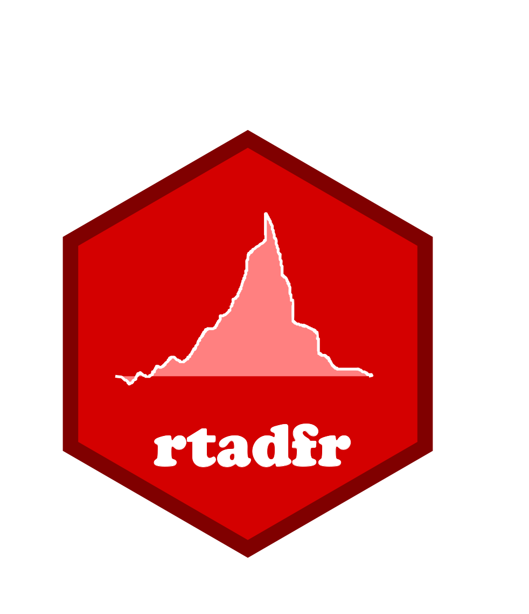

rtadfr 
======================

The R package *rtadfr* (Right Tailed ADF Tests with R) provides methods and tools for testing for bubbles in univariate time series.

## Installation

You can install the **development** version from
[Github](https://github.com/icaspi99/rtadf)

```s
# install.packages("devtools")
devtools::install_github("icaspi99/rtadfr")
```

## Usage

```s
library(rtadf)

# SADF test

data(snp)  # load S&P 500 data
T    <-nrow(snp)  # Sample size
r0   <- round(T*(0.01+1.8/sqrt(T)))  # Minimal window size

test <- rtadf(snp[,1], r0, test = "sadf")  # estimate test statistic and date-stamping sequence
cvs  <- rtadfSimPar(T, nrep = 1000, r0, test = "sadf")  # simulate critical values and date-stamping threshold

testDf <- list("test statistic" = testStat$testStat, "critical values" = cvs$testCVs)  # test results

print(testDf)  
  
dateStampDf <- ts(cbind(testStat$testSeq, cvs$datestampCVs[,2]),
                  start = c(1870,1), frequency = 12)  # data for datestamping procedure

ts.plot(df, plot.type = "single", col=c("blue", "red"))
```

## For more information on the methods used in the package see

  * Phillips, P. C. B., Wu, Y., & Yu, J. (2011). Explosive Behavior in the 1990s Nasdaq: When Did Exuberance Escalate Asset Values? *International Economic Review*, 201(1), 201--226.
  * Phillips, P. C. B., Shi, S., & Yu, J. (2015). Testing for multiple bubbles: Historical episodes of exuberance and collapse in the S&P 500. *International Economic Review*, 56(4), 1034–1078.
  
  

## License

This package is free and open source software, licensed under GPL-3.
